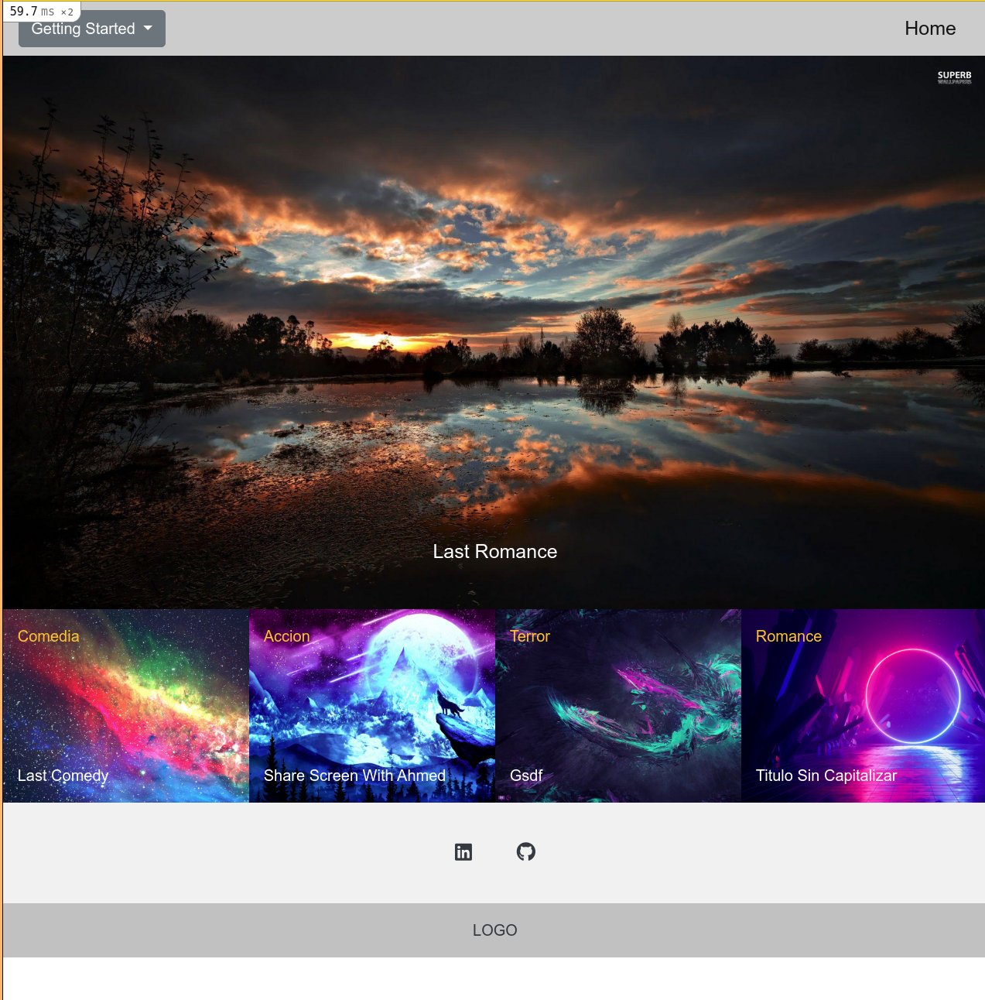

# Private Events

This is Logo, the website focused on the movie articles. There are 4 main categories for the articles . This web page allows the registration of a new users, edit information and authenticates them, users can create articles and assign them a category, they can also vote for the articles they like the most.
At the home page they can see the most voted article and at the bottom the most recent articles.

This site has been created mainly with Ruby on Rails as a framework, PostgreSQL database and bootstrap for CSS.


## Built With

- Ruby 2.7.2
- Ruby on Rails 6.1.1
- PostgreSQL
- Rspec gem
- Simple_form gem
- Devise gem
- Shrine gem
- Bootstrap

### Setup

To run this project locally, please ensure you have Ruby and Ruby on Rails installed on your machine, then clone this repository by running.

```bash
git clone https://github.com/Wusinho/Rails-Capstone.git
```

Open your terminal and CD to the directory where you create the clone repository.

Now run:

```bash
bundle install
```

The next two steps are important to avoid an error of action text.

First run:

```bash
yarn install --check-files
```

Then you need to reinstall action text with:

```bash
rails action_text:install
```

If the install asks you to overwrite something, just enter:

```bash
n
```

To setup the database run:

```bash
rails db:create
rails db:migrate
```

Is super important to populate the app, so now run:

```bash
rails db:seed
```

To set up the server put:

```bash
rails s
```

After this you can open your favorite web-browser and copy paste the next:

```bash
http://localhost:3000
```

### Author

👤 **Heber Lazo**

- Github: [@Wusinho](https://github.com/Wusinho)
- LinkedIn: [Heber Lazo](https://www.linkedin.com/in/heber-lazo-benza-523266133/)

## Show your support

Give a ⭐️ if you like this project!

## Acknowledgments

- Microverse

## 📝 License

This project is [MIT](LICENSE) licensed.
